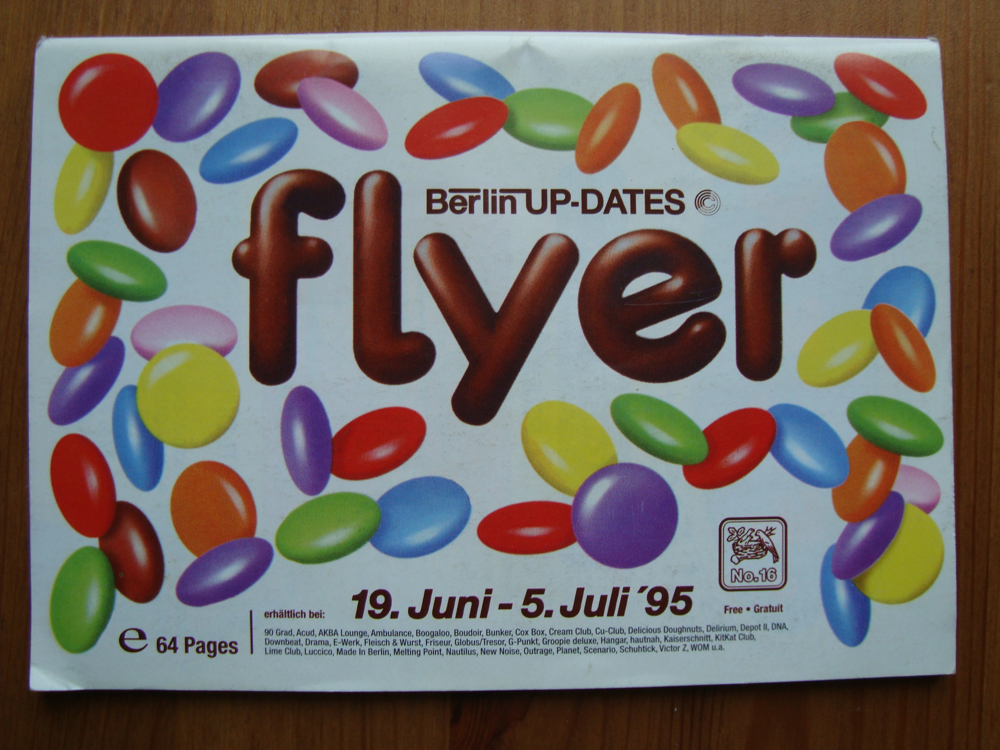

# Flyer - Berlin Up-Dates From 2001
 

The flyer was a Berlin city magazine in A6 format. The magazine was published every 2 weeks and was available free of charge. Contents of the flyer were the program in the clubs of the next 2 weeks. The flyer was published by the Zeitbank publishing house. The founder of the publishing house was Marc Wohlrabe.

In 2000, the flyer commissioned the agency Fork Unstable Media to develop a new website. Just like in the print magazine, the website was to present the events in Berlin clubs. Part of the project was a content management system, innovative for the time, that allowed the Flyer's editorial staff to create articles for both the website and the print magazine, hi-tech at the end of the 90s. The future of the Internet was here. There was one problem, the launch of the new website took place on the morning of September 11, 2001, and not many people looked at the new site on the evening of that day.

This repository contains the original source code of the project from September 12, 2001. The project was developed with [Apache Turbine](https://turbine.apache.org/). Object-relational mapper was [Apache Torque](https://db.apache.org/torque/torque-5.0/index.html).
